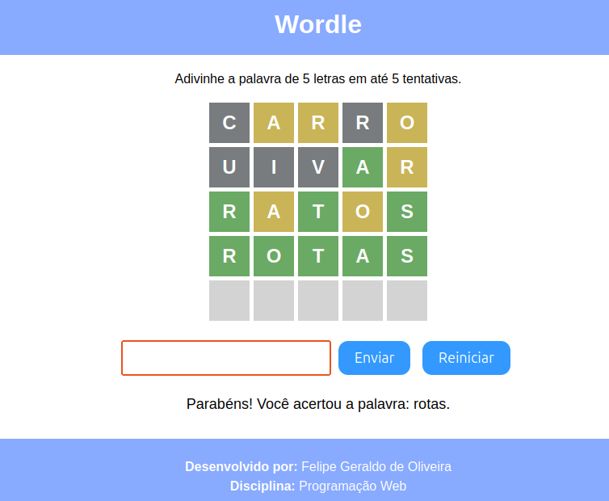

# Wordle — Atividade Prática 1 (GAC116)

Jogo de adivinhação de palavras inspirado no Wordle, desenvolvido com HTML, CSS, JavaScript e jQuery.



## Jogo publicado

Após configurar o GitHub Pages, o jogo ficará disponível em:

**https://felipeoliveira456.github.io/ap1/**

> Configure em *Settings → Pages → Branch: main → Folder: /src*.

## Objetivo

Adivinhar uma palavra secreta de 5 letras em até 5 tentativas. A cada chute, as letras recebem cores que indicam o quão perto você está da resposta.

## Regras

1. Digite uma palavra com **5 letras** e clique em **Enviar** (ou pressione Enter).
2. Você tem **5 tentativas** no total.
3. As cores significam:
   - **Verde** — letra certa na posição certa.
   - **Amarelo** — letra existe na palavra, mas em outra posição.
   - **Cinza** — letra não existe na palavra (ou já foi usada por outra letra verde/amarela).
4. Se acertar a palavra → vitória.
5. Se esgotar as tentativas → derrota (a palavra correta é revelada).
6. **Reiniciar** inicia uma nova partida com outra palavra aleatória da lista.

### Exemplo (letras repetidas)

Palavra secreta: `casos`  
Chute: `casas`

| C | A | S | A | S |
|---|---|---|---|---|
| verde | verde | verde | cinza | verde |

O segundo **A** não fica amarelo porque o **A** da palavra secreta já foi consumido pelo A verde na posição 2.

## Como executar localmente

Não é necessário instalar dependências. Basta abrir o arquivo HTML no navegador ou usar um servidor local:

```bash
cd src
python3 -m http.server
```

Acesse `http://localhost:8000` no navegador.

## Tecnologias utilizadas

- HTML5
- CSS3
- JavaScript
- [jQuery 3.7.1](https://jquery.com/)

## Estrutura do projeto

```text
ap1/
├── assets/
│   └── screenshot.png
├── LICENSE
├── README.md
└── src/
    ├── index.html
    ├── styles.css
    └── script.js
```

## Informações do jogo

```json
{
  "nome": "Wordle",
  "descricao": "Jogo de adivinhação de palavras de 5 letras em até 5 tentativas, com feedback por cores (verde, amarelo e cinza), inspirado no Wordle original.",
  "autores": "Felipe Geraldo de Oliveira",
  "turma": "14A"
}
```

> Ajuste `"autores"` e `"turma"` se necessário antes de entregar.

## Licença

Este projeto está licenciado sob a [MIT License](LICENSE).
